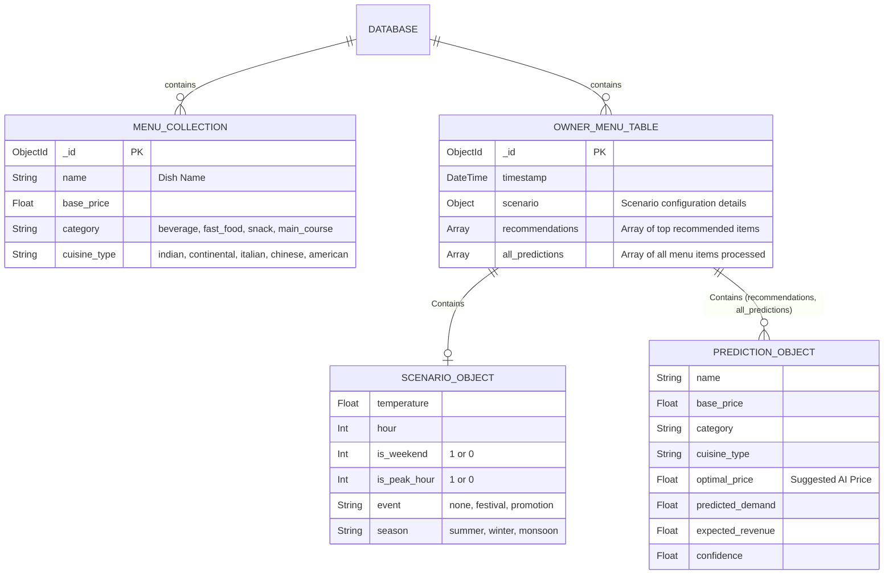
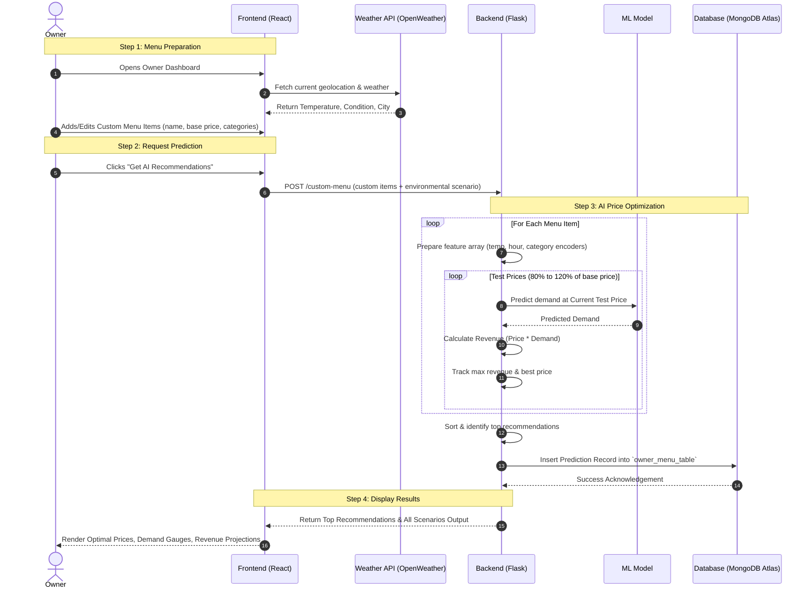

# AI-Driven Dynamic Pricing for Restaurants: Architecture & Workflow

This document outlines the Data Entity-Relationship Model and the Application Workflow for the AI-Driven Pricing project.

## 1. Entity-Relationship (ER) Diagram

The backend relies on MongoDB (Atlas) under the database `flavor_ai`. The ER diagram below shows the primary collections used in the application.

> [!NOTE] 
> Since MongoDB is a NoSQL database, the "ER diagram" primarily represents the schema of documents stored within collections instead of strict relational tables.

## 2. System Workflow

The following is the high-level system workflow encompassing how a restaurant owner interacts with the system to generate AI-driven dynamic prices.

### Core User Journey

1. **Dashboard Initialization:** Owner opens the `OwnerDashboard` via the Frontend (React). 
2. **Weather Synchronization:** The app fetches the current real-time weather and temperature using the device location and OpenWeather API.
3. **Menu Management:** Owner manages their current list of menu items and base prices.
4. **Trigger AI Analysis:** Owner clicks "Get AI recommendations".
5. **Backend Processing & AI:** Data is sent to the Flask Backend. The Machine Learning prediction model (`demand_model.pkl`) processes different price points in the current scenario (weather + time of day + season) to find the price that maximizes expected revenue.
6. **Data Storage:** Predictions are securely saved to MongoDB Atlas for persistence and historical tracking.
7. **Frontend Presentation:** Final data returns, presenting the owner with full analytics, expected changes in demand, and revenue optimizations.

### Workflow Sequence Diagram

## Summary of Storage

- **`menu` Collection:** Acts as a generic or main menu repository for the restaurant. Handled by endpoints like `/add-item`, `/get-menu`, `/update-item`, etc.
- **`owner_menu_table` Collection:** Stores historical AI-prediction tasks that the owner creates dynamically through the dashboard (from `/custom-menu`). Useful for creating tracking modules or historical revenue comparison views in the future.
